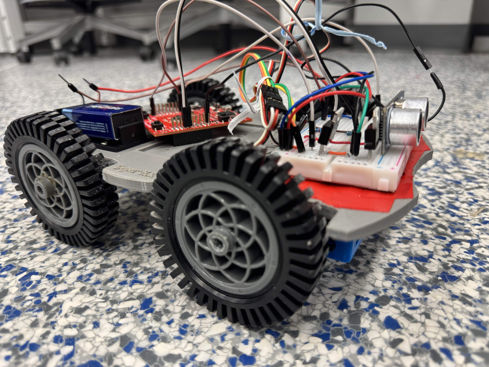
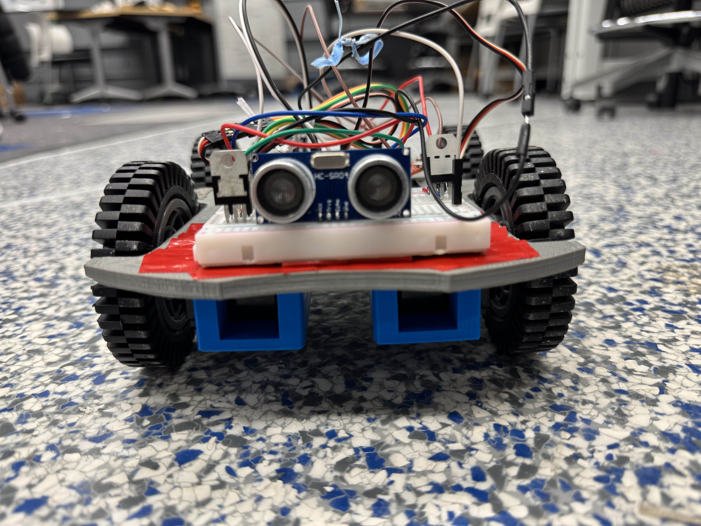

# Adaptive Cruise Control
Adaptive Cruise Control is a small mobile robotic car that implements adaptive cruise control!

  
  

## About the Project!
This project was developed by a team of two implementing an adaptive cruise control system on a mobile robot. We programmed it using bare-metal embedded C and assembly on the Tiva TM4C123GH6PM microcontroller.

The system continously measures the distance in front using ultrasonic sensors and adjusts motor speed to maintain a following distance. 

## What I learned
- Strengthened by ability to program on a bare-metal embedded environment with direct register-level programming and peripheral configuration.
- Gained hands-on experience configuring PWM and Timers with Input Capture.
- Improved debugging skills by using oscilloscopes to valitate PWM duty cycles and waveforms.
- Developed deeper understanding how to intereface microcontroller systems with real-world components and sensors.

## What Challenges I faced
Under time constraints, I faced challenges converting the hardware timer capture values into an accurate distance measurement in centimeters. However, I maintained progress by mapping raw timer values with real-world measured distances in Excel. Then I used a linear regression model (slope & intercept) to achieve a reliable distance estimation within 1cm.

## Tools Used
- **Microcontroller:** Tiva TM4C123GH6PM
- **Programming Languages:** Embedded C and ARM Assembly
- **Development Tools:** Code Composer Studio, VSCode, Excel, Git
- **Debugging Tools:** Oscilloscope and Multimeter
- **Hardware Peripherals:** Pulse Width Modulation (PWM), Hardware Timers, General Purpose Input/Output (GPIO)

## Datasheets Referenced
- **Tiva TM4C123GH6PM Microcontroller** - [Datasheet Link](https://www.ti.com/lit/ds/symlink/tm4c123gh6pm.pdf?ts=1782663824098&ref_url=https://www.ti.com/product/TM4C123GH6PM%253Futm_source=google&utm_medium=cpc&utm_campaign=epd-tech-inno-dynpf_mcuproc-cpc-pf-google-eu_en_int&utm_content=prodfolddynamic&ds_k=DYNAMIC+SEARCH+ADS&dcm=yes&gclsrc=aw.ds&gad_source=1&gad_campaignid=23830055180&gbraid=0AAAAAC068F2O39gx82943UaGDPpCEn1Kk)
- **HCSR04 Ultrasonic Sensor Module** - [Datasheet Link](https://cdn.sparkfun.com/datasheets/Sensors/Proximity/HCSR04.pdf)
- **Parallax 360 High Speed Servos** - [Datasheet Link](https://www.parallax.com/package/parallax-feedback-360-high-speed-servo-downloads/)

## Running this project
I would suggest to follow the steps in our documentation, there is multiple wiring and steps to set up our robot. All of our parts and resources can be found [here](/documentation/CSE%20479%20-%20Adaptive%20Cruise%20Control%20Project%20Documentation.pdf) and videos of our project running can be found in our [assets folder](/assets)!

## What's Next?
- Adding turning movement on wheels to allow robot to turn directionality.
- Integrate a remote control to allow user to switch between autonomous and user controlled.
- Fixing issues with adjusting speed when distance gets smaller.
- Build up a body with a newly 3D printed design with adjusted wiring.

## Contributors
- Kenneth Pang - [Github](https://github.com/KennyPang04)
- Ornie Payer - [Github](https://github.com/Ornipay)